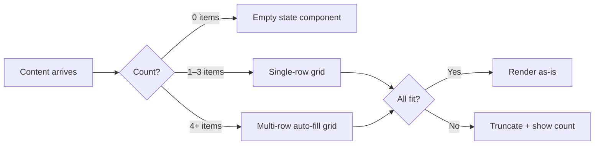

## The Problem with Perfect Grids

Every grid looks great in a mockup. The columns align, the gutters breathe, the content fits neatly in every cell. Then reality arrives.

Real content is messy. Titles run long. Images arrive at unexpected aspect ratios. Dynamic data can have zero items or two hundred. A grid that works only when the content cooperates is not a robust grid — it's a fragile prototype.

The key insight is that a grid's failure modes are part of its specification, not exceptions to it.

## How Grid Placement Actually Works

CSS Grid's auto-placement algorithm is smarter than most developers give it credit for.

```css
.grid {
  display: grid;
  grid-template-columns: repeat(auto-fill, minmax(240px, 1fr));
  gap: 1.5rem;
}
```

The `auto-fill` keyword tells the browser to create as many columns as will fit. The `minmax(240px, 1fr)` constraint ensures each column is at least 240px wide but grows proportionally. This single rule handles breakpoints automatically.

When items overflow, the algorithm wraps them. When there are no items, the grid simply disappears — its container collapses to zero height without leaving phantom whitespace.

## Mermaid: Content → Layout Decision Tree



## Responsive Without Media Queries

The common pattern of writing three breakpoint rules for a grid can often be replaced with a single intrinsic rule. Consider the difference:

```css
/* Fragile: assumes specific viewport widths */
.grid { grid-template-columns: 1fr; }
@media (min-width: 640px) { .grid { grid-template-columns: 1fr 1fr; } }
@media (min-width: 1024px) { .grid { grid-template-columns: 1fr 1fr 1fr; } }

/* Resilient: responds to available space, not assumed device */
.grid { grid-template-columns: repeat(auto-fill, minmax(280px, 1fr)); }
```

The second approach also handles edge cases the first doesn't: a sidebar layout, a narrower viewport, an unexpected container width from a parent component.

## Handling Long Content

The most common grid failure: a title wraps unexpectedly and pushes the grid item's height, misaligning adjacent items.

Grid's `align-items: start` (versus the default `stretch`) lets items be their natural height without forcing alignment on siblings. For card layouts where visual alignment matters more than content height uniformity, `stretch` is often the wrong default.


## The Design Intent Behind `fr`

Fractional units communicate design intent in a way percentages cannot. When you write `grid-template-columns: 1.4fr 1fr`, you're saying the first column should be 40% more prominent than the second — not that it should be 58.33% of the container width. The intent is preserved even when the container changes size.

This portfolio uses `grid-cols-[1.4fr_1fr]` on the blog list for exactly this reason: the post list should feel heavier and more primary than the sidebar, in all viewport conditions.

## Summary

Grids fail gracefully when you treat failure as a design constraint rather than an edge case. The tools are already in CSS Grid's vocabulary — `auto-fill`, `minmax`, `align-items: start`, fractional units. The practice is recognizing which failure modes your layout will encounter and specifying them upfront.
