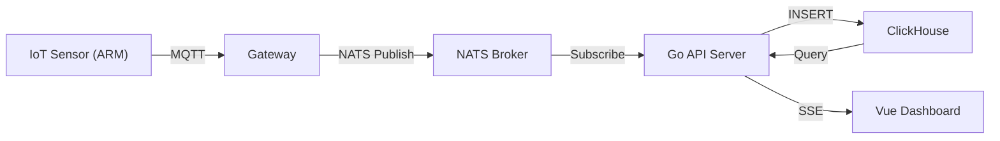

## Brief

Field Monitor is a real-time telemetry dashboard for agricultural IoT sensors deployed at the network edge. Farmers and agronomists use it to track soil moisture, temperature, and humidity across multiple zones from a single interface.

The system handles thousands of concurrent sensor connections, persists time-series data efficiently, and delivers live updates to browser clients without polling.

## Process

The project started with a proof-of-concept using WebSockets and PostgreSQL. Early load tests showed that relational storage couldn't keep up with the write throughput from 500+ concurrent sensors.

We migrated to ClickHouse for time-series persistence and introduced NATS as the message broker between edge agents and the backend API. The frontend moved to Server-Sent Events, which simplified client reconnection logic and reduced server overhead.

Deployment runs on bare-metal nodes at the farm co-location, with a lightweight Go agent compiled for ARMv7 on each sensor gateway.

## Tech Decisions

The core architectural challenge was decoupling sensor ingestion from dashboard delivery without introducing complex distributed systems.

NATS was chosen over Kafka because the message volume didn't justify Kafka's operational overhead, and NATS's at-most-once delivery was acceptable for live telemetry (missing one reading is fine; duplicating one is not).

ClickHouse's columnar storage and built-in time-bucketing functions (`toStartOfInterval`) made rollup queries fast without a separate aggregation pipeline.
