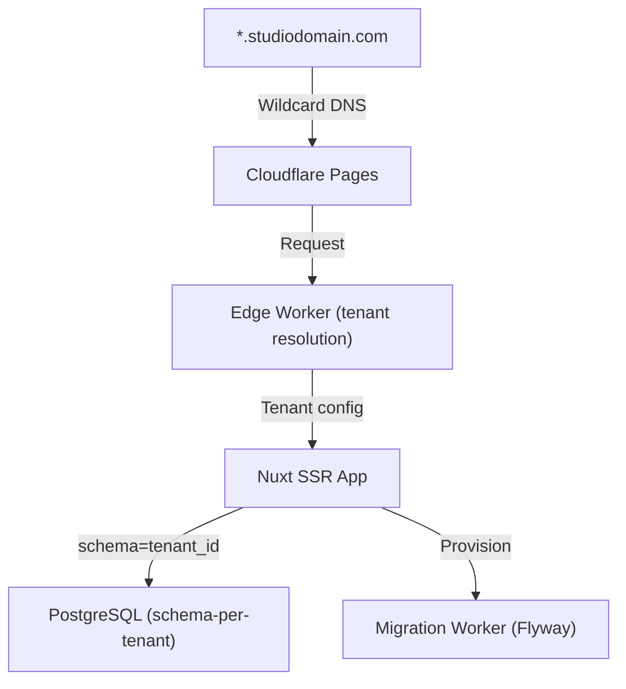

## Brief

Hina is a multi-tenant SaaS platform that lets language learning studios manage courses, students, and assignments from a shared infrastructure while keeping tenant data strictly isolated.

Studio owners configure their subdomain, branding, and curriculum; students access their portal through the branded URL. The platform handles billing, seat limits, and content delivery.

## Process

The initial architecture used row-level tenant isolation in a single PostgreSQL database. As the tenant count grew past 30, query plans started ignoring indexes due to bloated statistics.

We migrated to a schema-per-tenant model. Each new tenant gets a dedicated PostgreSQL schema provisioned automatically at signup via a Cloudflare Worker that runs Flyway migrations. This kept query plans predictable and simplified data residency requirements for European customers.

The frontend is a Nuxt 3 app deployed to Cloudflare Pages, with a shared component library published as a private npm package consumed by each tenant's customizable shell.

## Tech Decisions

The key design challenge was enabling tenant customization without forking the codebase.

The edge worker resolves the tenant from the hostname, injects a config header (`X-Tenant-ID`, `X-Tenant-Theme`), and forwards to the Nuxt app. The app reads the header to select the correct PostgreSQL schema and apply the tenant's design tokens at runtime.

This avoided a per-tenant deployment model while keeping strict data isolation — a deliberate trade-off between operational simplicity and isolation granularity.
